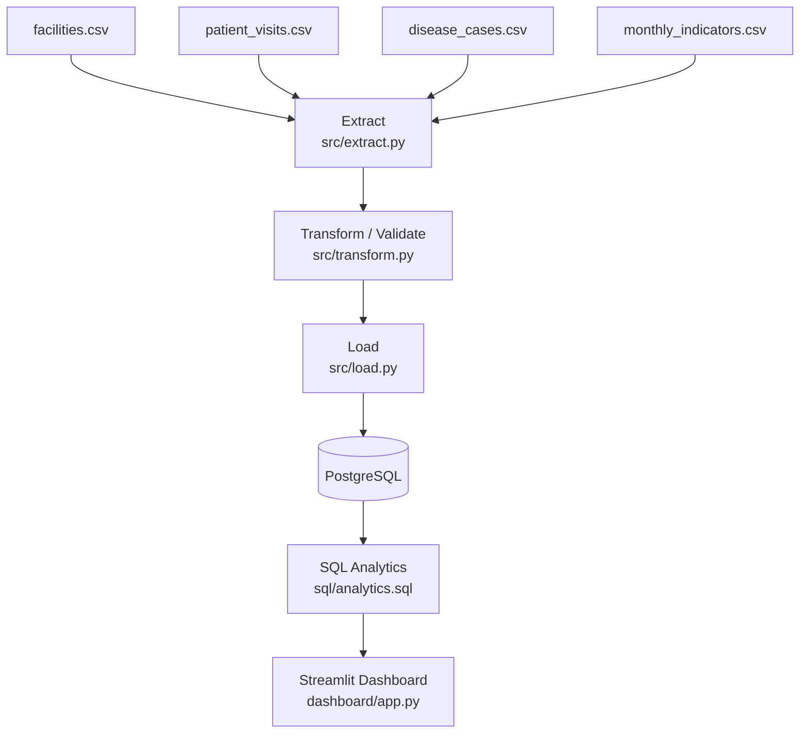
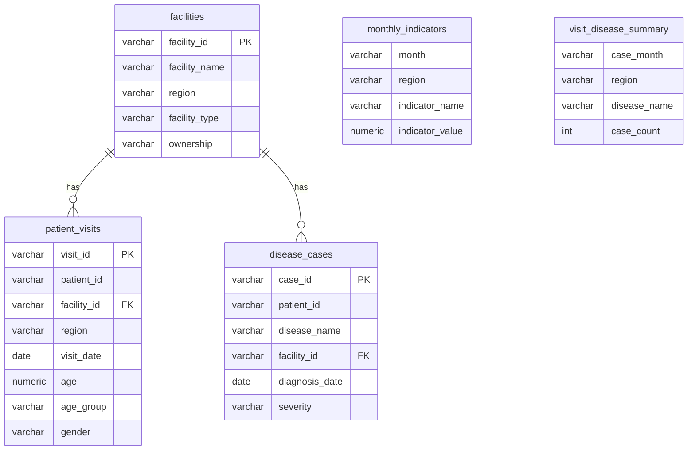

# Multi-Source Health Data Integration Pipeline

A **small, realistic, end-to-end data engineering project** demonstrating a multi-source
data integration and ETL pipeline. It is not, and does not claim to be, a "big data" or
"enterprise-scale" system — it is intentionally sized for one person to build, run,
debug, and explain confidently in an interview.

---

## 1. Project Overview

This project simulates a common real-world scenario in the health/public-sector data
space: several systems (a facility registry, a patient visit log, a disease-surveillance
system, and a national health information system) each export their own data in their
own format, and someone needs to bring it all together into one place for reporting.

The pipeline:

1. **Extracts** four CSV sources (synthetic, not real patient data).
2. **Transforms** them — cleaning, standardizing, joining, validating, aggregating.
3. **Loads** the result into **PostgreSQL**.
4. Exposes **SQL analytics** (aggregate queries + views).
5. Visualizes everything in a **Streamlit dashboard** that reads only from PostgreSQL.
6. Is fully **Dockerized** (`docker compose up --build` starts everything).
7. Has a **GitHub Actions** CI workflow that tests and validates the code on every push.
8. Has a **pytest** suite covering the cleaning/transformation logic.

## 2. Problem Statement

Health data in most low-resource settings is fragmented across systems that were never
designed to interoperate: a facility master list, a visit register, a disease
surveillance log, and monthly indicator reports from a system like DHIS2. Each names
columns differently, formats dates differently, and has data-quality issues (duplicates,
missing values, inconsistent spellings). Before anyone can produce a single trustworthy
report, that data has to be integrated. This project builds a small but complete pipeline
that does exactly that — the same lifecycle a production data platform uses, just at a
scale one person can hold in their head.

## 3. Architecture



Everything is orchestrated by `src/pipeline.py`, which calls `extract() -> transform() ->
load()` in sequence. The dashboard is a separate process that only ever talks to
PostgreSQL — never to the original CSV files — so it always reflects what the pipeline
actually loaded.

## 4. Data Sources

Four small **synthetic** (fake, generated) CSV files, produced by
`src/generate_data.py`, deliberately structured like real, uncoordinated systems:

| File | Rows | Key columns | Quirks (on purpose) |
|---|---|---|---|
| `facilities.csv` | ~18 | `facility_id`, `facility_name`, `region` | inconsistent region spelling, 1 duplicate row |
| `patient_visits.csv` | ~500 | `visit_id`, `facility_code`, `region_name`, `visit_date`, `age` | different column names than facilities, 4 date formats, some negative/missing ages, duplicate rows |
| `disease_cases.csv` | ~300 | `case_id`, `facility` (a **name**, not an ID), `diagnosis_date` | facility referenced by name, not ID; missing severities |
| `monthly_indicators.csv` | ~432 | `month`, `region`, `indicator_name`, `indicator_value` | pre-aggregated, DHIS2-style reporting data |

No real patient data is used anywhere in this project.

To regenerate the data at any time (same seed = same data every run):
```bash
python src/generate_data.py
```

## 5. ETL Workflow

### What is ETL, and why split it into 3 stages?
**Extract, Transform, Load** is the classic pattern for moving data from source systems
into an analytics-ready store. Splitting the pipeline into three separate stages/files
(`extract.py`, `transform.py`, `load.py`) means each stage can change independently: you
could swap a CSV source for an API without touching cleaning logic, or swap PostgreSQL
for another database without touching extraction or cleaning logic. Each stage is also
independently runnable and testable.

- **`src/extract.py`** — reads the 4 raw CSVs into pandas DataFrames as plain text
  (`dtype=str`). It does *no* cleaning — extraction should just "get the data out",
  nothing more.
- **`src/transform.py`** — the bulk of the engineering work. Standardizes column names,
  parses inconsistent date formats, standardizes region/gender spellings, nulls out
  impossible ages, drops duplicates, resolves the `disease_cases.facility` **name** to a
  `facility_id`, validates required fields, creates a calculated `age_group` field, and
  builds an aggregated `visit_disease_summary` table via a join + group-by across
  sources.
- **`src/load.py`** — connects to PostgreSQL via SQLAlchemy, (re)creates the schema from
  `sql/schema.sql`, truncates and reloads each table (making the pipeline safely
  re-runnable), then (re)creates the analytics views from `sql/analytics.sql`.
- **`src/pipeline.py`** — the single entry point that runs all three stages in order.
  This is what Docker and GitHub Actions call.

Each transformation function in `transform.py` is documented inline with **what** it
does and **why** it's necessary — read that file for the full reasoning.

## 6. Database Schema



This is a simplified **star schema**: `facilities` is the dimension (master) table;
`patient_visits` and `disease_cases` are fact tables referencing it by foreign key.
`monthly_indicators` is a separate pre-aggregated fact table. `visit_disease_summary` is
a **materialized aggregate** produced by the transform stage itself (not loaded
verbatim from a source) so the dashboard can query a small, pre-computed table instead
of repeating an expensive join + group-by on every page load.

Full DDL: [`sql/schema.sql`](sql/schema.sql).

## 7. SQL Analytics

[`sql/analytics.sql`](sql/analytics.sql) contains the reporting queries, including:
total counts, visits by region, cases by disease (with percentage share, using a window
function), monthly trends, top-5 facilities by visit volume (a join + group-by + limit),
age-group breakdowns, and the latest reported value of each indicator per region (using
`DISTINCT ON`). Four of these are wrapped as reusable **views**
(`view_visits_by_region`, `view_cases_by_disease`, `view_monthly_visit_trend`,
`view_top_facilities`) so both the dashboard and any ad-hoc SQL client can query them
directly.

## 8. Dashboard

[`dashboard/app.py`](dashboard/app.py) is a Streamlit app. It shows KPI cards (total
facilities/visits/cases, latest data month), a monthly visit trend, a monthly disease
case trend, visits-by-region and cases-by-disease bar charts, a top-facilities table, an
age-group breakdown, and a table of the latest indicator values per region.

**Every number on the dashboard comes from a SQL query against PostgreSQL** — the
dashboard never reads the original CSVs. This mirrors how real BI tools (Metabase,
Looker, PowerBI) sit on top of a warehouse rather than re-reading source spreadsheets,
and it proves the ETL pipeline is the single source of truth.

Run it locally (after running the pipeline at least once):
```bash
streamlit run dashboard/app.py
```

## 9. Docker Setup

One [`Dockerfile`](Dockerfile) is shared by both the ETL job and the dashboard — they
need identical dependencies, so a second image would just duplicate layers. Which
process runs is decided by the `command:` set per-service in
[`docker-compose.yml`](docker-compose.yml).

Three services:
- **`db`** — `postgres:16-alpine`, with a healthcheck (`pg_isready`).
- **`pipeline`** — builds from the `Dockerfile`, runs `python src/pipeline.py` **once**
  and exits. Waits for `db` to be healthy before starting.
- **`dashboard`** — builds from the same `Dockerfile`, runs `streamlit run
  dashboard/app.py` continuously. Waits for `pipeline` to **complete successfully**
  before starting, so it never queries an empty database.

**How the containers communicate:** Compose puts all three services on one private
Docker network. Inside that network, containers reach each other **by service name**
as a hostname — that's why `DB_HOST=db` works in `pipeline` and `dashboard`'s
environment variables, even though there's no real machine called `db`; Docker's
internal DNS resolves it to the `db` container's IP address. This is also why the code
never hardcodes `localhost` for the database connection — inside a container,
`localhost` means the container itself.

Start everything:
```bash
docker compose up --build
```
Then open the dashboard at **http://localhost:8501**.

## 10. CI/CD Workflow

[`.github/workflows/ci.yml`](.github/workflows/ci.yml) runs on every push/PR to `main`:

1. Checks out the code and sets up Python 3.11.
2. Installs dependencies from `requirements.txt`.
3. Starts a **real PostgreSQL service container** (GitHub Actions' "service containers"
   feature — a genuine Postgres instance runs alongside the job, not a mock).
4. Regenerates the synthetic datasets (CI doesn't rely on committed data files).
5. Runs the **pytest suite** (the pure transform logic).
6. Runs the **full pipeline** end-to-end against the service-container database — this
   is what actually proves extract → transform → load works, beyond just unit tests.
7. Builds the **Docker image** as a smoke check (confirms the image builds; it does not
   run a full `docker compose up`, to keep CI fast).

There is intentionally no deployment step, no cloud credentials, and nothing gets
published — this is a validation pipeline, not a release pipeline, matching the "keep
CI/CD simple" requirement.

## 11. Testing

[`tests/test_pipeline.py`](tests/test_pipeline.py) has 15 pytest tests covering:
region/gender standardization, multi-format date parsing (including unparseable dates
becoming `NaT` instead of crashing), age validation (negative/impossible ages nulled
out), age-group bucketing, duplicate removal, dropping rows with missing required
fields, resolving a disease case's facility **name** to a **facility_id** (and dropping
cases where no match is found), numeric validation on indicator values, and the
cross-source aggregate (`visit_disease_summary`) producing correct counts.

These test the **transform** stage specifically (pure functions, no database needed) —
fast, deterministic, and exactly what an interviewer is likely to ask you to walk
through. `load.py` is exercised by actually running the pipeline (locally, in CI, or in
Docker) against a real Postgres instance instead, since it's mostly infrastructure glue.

Run:
```bash
pytest tests/ -v
```

## 12. How to Run Locally (without Docker)

```bash
# 1. Create and activate a virtual environment (recommended)
python -m venv .venv
source .venv/bin/activate        # Windows: .venv\Scripts\activate

# 2. Install dependencies
pip install -r requirements.txt

# 3. Start a local PostgreSQL instance and create the database
#    (adjust to however you run Postgres locally, e.g. via WSL's postgres,
#    or `docker run -p 5432:5432 -e POSTGRES_PASSWORD=postgres postgres:16-alpine`)
createdb health_pipeline

# 4. Set connection environment variables (defaults shown match a typical local setup)
export DB_HOST=localhost DB_PORT=5432 DB_NAME=health_pipeline \
       DB_USER=postgres DB_PASSWORD=postgres

# 5. Generate the synthetic data
python src/generate_data.py

# 6. Run the pipeline (extract -> transform -> load)
python src/pipeline.py

# 7. Run the tests
pytest tests/ -v

# 8. Launch the dashboard
streamlit run dashboard/app.py
```

## 13. How to Run with Docker

```bash
docker compose up --build
```
This starts PostgreSQL, runs the ETL pipeline once, then starts the dashboard at
**http://localhost:8501**. To stop everything: `docker compose down` (add `-v` to also
delete the Postgres data volume and start fresh next time).

## 14. Example Results

After a successful run, the dashboard shows (using the default synthetic dataset):
- **18** facilities, **500** patient visits, **300** disease cases loaded.
- A monthly visit-count trend across Jan 2024–Dec 2025.
- Pneumonia, Diabetes, and Hypertension as the top three diseases by case share.
- A top-10 facilities table ranked by visit volume.
- An age-group breakdown (0–4, 5–17, 18–39, 40–59, 60+).

(Exact numbers will vary slightly if you regenerate the synthetic data without the fixed
random seed, or modify `generate_data.py`.)

## 15. Technologies Used

Python 3.11 · pandas · NumPy · PostgreSQL 16 · SQLAlchemy · psycopg2 · Streamlit ·
pytest · Docker & Docker Compose · GitHub Actions.

## 16. Possible Future Improvements

- Incremental/upsert loading instead of truncate-and-reload, for larger datasets.
- Data-quality reporting (e.g. a `dq_report` table logging how many rows were dropped
  and why, on every run) instead of only printing warnings to the console.
- A real second data source via a public API (e.g. a weather or WHO indicator API) to
  demonstrate non-file extraction.
- Parameterizing the dashboard with date-range and region filters.
- Replacing the manual `;`-based SQL-file splitting in `load.py` with a proper
  migration tool (e.g. Alembic) if the schema were expected to evolve over time.

---

## Interview Questions You Might Get About This Project — and How to Answer Them

**Q: Why did you choose PostgreSQL instead of a NoSQL database?**
A: The data is inherently relational — facilities have many visits and cases, and the
whole point of the project is demonstrating joins, foreign keys, and SQL aggregation.
PostgreSQL is free, runs locally with minimal setup, and is one of the most widely used
production databases, so it's a realistic, transferable choice.

**Q: Why truncate-and-reload instead of incremental loading?**
A: This project's pipeline is meant to be re-run from scratch (e.g., in CI, or after
regenerating synthetic data), so idempotency mattered more than efficiency at this
scale. Truncate-then-load guarantees running the pipeline twice gives the same result.
At real production scale, I'd move to incremental/upsert loading keyed on natural IDs
or a `last_updated` watermark, but that adds complexity this project doesn't need to
demonstrate the core concepts.

**Q: How would this scale to millions of rows?**
A: pandas holds everything in memory, which is fine at this scale but would need
rethinking beyond a few million rows — e.g., chunked reads/writes, or moving the
heavier transformations into SQL itself (running them inside PostgreSQL rather than in
pandas), or a proper distributed engine if the data volume justified it. I deliberately
kept this project small to demonstrate the lifecycle clearly, not to pretend I've
built something at big-data scale.

**Q: Why did you separate extract/transform/load into different files/functions?**
A: Single-responsibility: each stage does one job and can be tested, replaced, or
scaled independently of the others. It also matches how most production data teams
actually structure pipelines, so it's a transferable pattern, not an academic exercise.

**Q: What was the hardest data-quality problem you had to handle?**
A: `disease_cases.csv` links to a facility by **name**, while every other source links
by **ID**. Names aren't a safe join key in general (they can collide or be renamed), so
the transform stage resolves each name to a `facility_id` using the facilities master
list, and explicitly drops (and logs) any case whose facility name doesn't match —
rather than silently guessing or crashing.

**Q: How do you know your transformations are correct?**
A: The pytest suite tests each cleaning function in isolation with small, hand-built
inputs (not the random synthetic data) so the expected output is unambiguous, e.g.,
feeding `parse_messy_date` a value in each of the four known formats and asserting they
all resolve to the same date.

**Q: Why Streamlit instead of a heavier BI tool like Power BI or Tableau?**
A: Streamlit is free, code-based (so it's version-controllable and testable like the
rest of the project), and fast to stand up for a small project. For a larger
organization with existing BI infrastructure, I'd connect that tool directly to the
same PostgreSQL database instead of maintaining a custom dashboard.

**Q: What would you change if this were a real production system?**
A: Add data-quality monitoring/alerting, incremental loads, a proper orchestrator
(e.g., Airflow or Dagster) instead of a single Python script, secrets management
instead of environment variables with default values, and probably a staging schema
separate from the "production" reporting schema.

**Q: Why GitHub Actions instead of a more complex CI/CD tool?**
A: It's free for public repos, integrates directly with GitHub, and needs no separate
infrastructure to run — appropriate for a project this size. The workflow demonstrates
the same core CI concepts (install, test, validate a real build) that a heavier tool
like Jenkins would also provide.

**Q: Walk me through what happens when I run `docker compose up --build`.**
A: Compose builds one image from the `Dockerfile` and starts three containers: `db`
(PostgreSQL) first, waited on via a healthcheck; `pipeline`, which runs the ETL script
once against `db` and exits; and `dashboard`, which waits for `pipeline` to finish
successfully, then starts a continuously running Streamlit server on port 8501 that
queries `db` for every chart.
